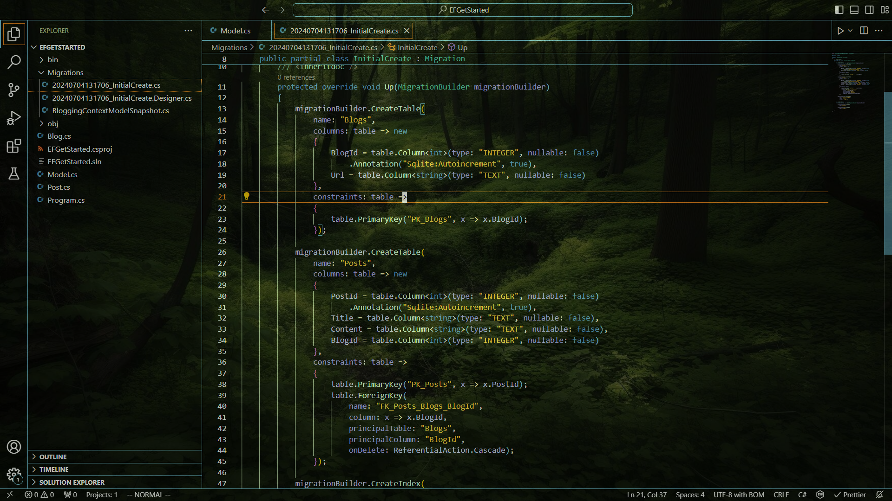
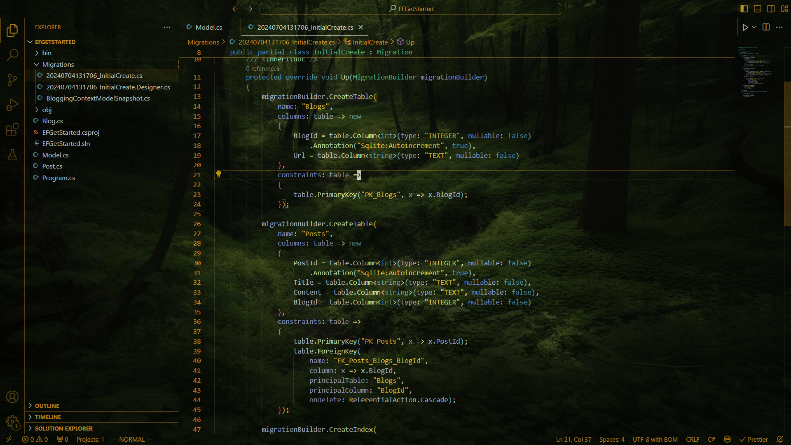
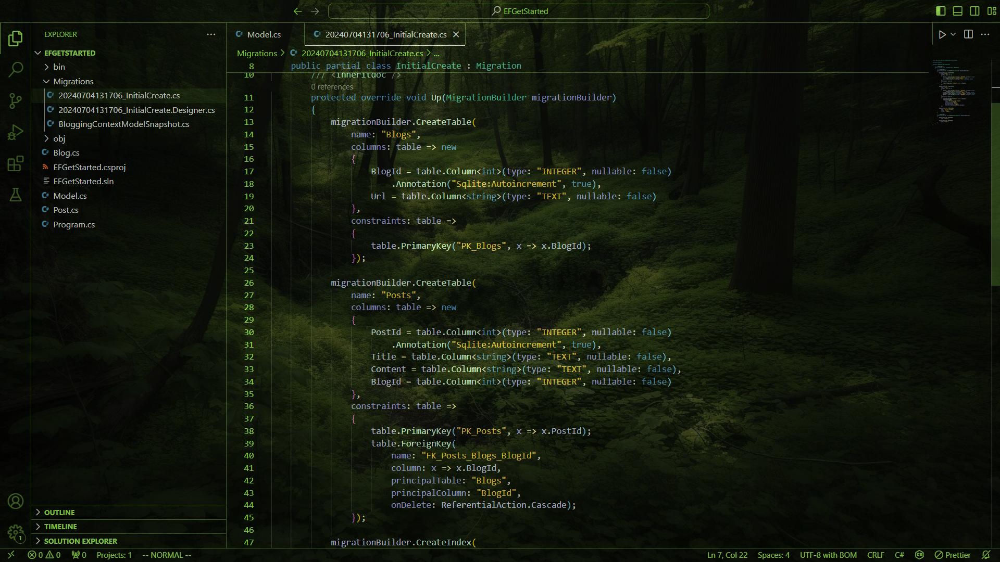

# GlassForest README

A custom theme for VSCode, based on the token colours from [Forest Cottage](https://vscodethemes.com/e/zephyrj.forest-cottage/forest-cottage-classic), by Zephyr Jones.

The UI Theming is based on the default high contrast theme.

This is designed to work well with GlassIt for transparency, in front of a greenish background.

## Flavours:
### GlassForest

### GlassForest-Autumn

### GlassForest-Glade

